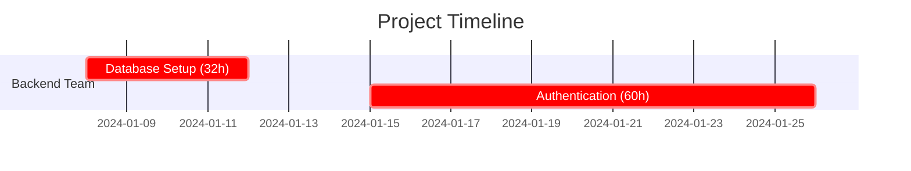

# Blueprint MVP Specification & Roadmap

## Minimum Viable Product (MVP)

### Core Capabilities

**Blueprint MVP enables text-based project management with modern tooling:**

- Define projects in human-readable TOML files
- Automatically compute schedules from tasks, dependencies, and resources
- Generate visual Gantt charts using Mermaid
- Track costs and resource utilization
- Use Git for version control and collaboration
- Perform basic what-if analysis through Git branches

### MVP Feature Set

#### 1. Project Definition (TOML Format)

```toml
[project]
name = "Web Application"
start_date = "2024-01-08"
currency = "USD"

[resources.sarah]
name = "Sarah Johnson"
role = "Backend Developer"
hourly_rate = 85.00
capacity = 1.0  # Full time

[tasks.database]
name = "Database Setup"
effort = 32  # hours
skills_required = ["postgresql"]
dependencies = []
priority = "critical"

[milestones.mvp]
name = "MVP Launch"
dependencies = ["database", "auth"]
target_date = "2024-03-15"
```

#### 2. Scheduling Engine

- **Dependency resolution**: Automatically order tasks based on dependencies
- **Resource allocation**: Assign tasks to resources based on skills and availability
- **Critical path calculation**: Identify bottlenecks and project completion date
- **Basic optimization**: Level resource usage and detect conflicts

#### 3. Command Line Interface

```bash
# Initialize new project
forge init "My Project" --template web-app

# Compute schedule
forge schedule --output reports/

# Generate specific reports
forge report gantt --format mermaid
forge report costs --format markdown
forge report resources --format table

# What-if analysis
forge analyze --scenario optimistic
```

#### 4. Mermaid Gantt Generation



#### 5. Cost Tracking & Reporting

- **Labor cost calculation**: hours × hourly rates
- **Budget tracking**: allocated vs. spent vs. projected
- **Resource utilization**: capacity planning and overallocation detection
- **External cost tracking**: equipment, licenses, services

#### 6. Git Integration

- **Project versioning**: Full history of project changes
- **Branch-based scenarios**: Create branches for what-if analysis
- **Collaboration**: Standard Git workflows (clone, push, pull, merge)
- **Conflict resolution**: Human-readable merge conflicts in TOML

#### 7. Basic Reporting

- **Schedule summary**: Start/end dates, critical path, milestones
- **Cost breakdown**: By resource, task, or time period
- **Resource allocation**: Workload distribution and conflicts
- **Progress tracking**: Completion percentages and timeline variance

### MVP Technical Architecture

```
┌─────────────────────┐
│   TOML Parser       │ ← Human-readable project files
└─────────┬───────────┘
          │
┌─────────▼───────────┐
│  Scheduling Engine  │ ← Dependency resolution & optimization
│  (Pure Rust)        │
└─────────┬───────────┘
          │
┌─────────▼───────────┐
│   Report Generator  │ ← Mermaid, Markdown, CSV output
└─────────┬───────────┘
          │
┌─────────▼───────────┐
│     Git Backend     │ ← Version control & collaboration
└─────────────────────┘
```

### MVP Deliverables

1. **forge-cli**: Single binary with all core functionality
1. **Project templates**: Pre-configured TOML files for common project types
1. **Documentation**: Getting started guide, TOML reference, CLI manual
1. **Integration guides**: VS Code, GitHub workflows, CI/CD examples

### MVP Success Criteria

- ✅ Create and schedule a 20-task project in under 5 minutes
- ✅ Generate publication-ready Gantt charts
- ✅ Track project costs with ±5% accuracy
- ✅ Support teams of 2-10 people on projects lasting 1-12 months
- ✅ Work offline with no external dependencies
- ✅ Git-native workflow for collaboration

## Future Expansion Hooks

### Phase 2: Enhanced User Experience (3-6 months)

#### Terminal User Interface (TUI)

```rust
// Hook: Interactive interface framework
pub trait UserInterface {
    fn display_project_overview(&self, project: &Project);
    fn edit_task_interactively(&self, task: &mut Task) -> Result<(), UIError>;
    fn show_gantt_chart(&self, schedule: &Schedule);
}

pub struct TerminalUI {
    // ratatui-based interactive interface
}
```

#### VS Code Extension

- Syntax highlighting for .forge files
- Inline Gantt chart preview
- Task management sidebar
- Git scenario visualization

#### Web Interface (Optional)

```rust
// Hook: REST API for web frontend
#[derive(Router)]
pub struct BlueprintAPI {
    // axum-based REST API
}

pub trait WebBackend {
    async fn get_project(&self, id: &str) -> Result<Project, APIError>;
    async fn update_schedule(&self, project: Project) -> Result<Schedule, APIError>;
}
```

### Phase 3: Advanced Project Management (6-12 months)

#### Resource Optimization Engine

```rust
// Hook: Pluggable optimization algorithms
pub trait SchedulingAlgorithm {
    fn optimize_schedule(&self, project: &Project) -> Result<Schedule, OptimizationError>;
}

pub struct GeneticAlgorithmOptimizer;
pub struct LinearProgrammingOptimizer;
pub struct HeuristicOptimizer; // MVP uses this
```

#### Time Tracking Integration

```rust
// Hook: Multiple time tracking backends
pub trait TimeTrackingBackend {
    async fn fetch_entries(&self, date_range: DateRange) -> Result<Vec<TimeEntry>, TrackingError>;
    async fn sync_to_project(&self, project: &mut Project) -> Result<(), SyncError>;
}

pub struct TogglBackend;
pub struct ClockifyBackend;
pub struct HarvestBackend;
```

#### Risk Management

```rust
// Hook: Risk analysis framework
pub struct RiskFactor {
    name: String,
    probability: f32,
    impact_multiplier: f32,
    affected_tasks: Vec<String>,
}

pub trait RiskAnalyzer {
    fn analyze_risks(&self, project: &Project) -> Vec<RiskAssessment>;
    fn simulate_scenarios(&self, risks: &[RiskFactor]) -> MonteCarloResult;
}
```

### Phase 4: Enterprise Features (12+ months)

#### Multi-Project Portfolio Management

```rust
// Hook: Portfolio-level optimization
pub struct Portfolio {
    projects: Vec<Project>,
    shared_resources: ResourcePool,
    strategic_priorities: Vec<Priority>,
}

pub trait PortfolioOptimizer {
    fn optimize_across_projects(&self, portfolio: &Portfolio) -> PortfolioSchedule;
    fn recommend_resource_moves(&self) -> Vec<ResourceReallocation>;
}
```

#### Accounting Integration

```rust
// Hook: External accounting systems
pub trait AccountingBackend {
    fn export_costs(&self, schedule: &Schedule) -> Result<AccountingExport, ExportError>;
    fn validate_budget(&self, project: &Project) -> Result<BudgetValidation, ValidationError>;
}

pub struct BeancountBackend;
pub struct QuickBooksBackend;
pub struct SAPBackend;
```

#### Advanced Analytics

```rust
// Hook: Business intelligence integration
pub trait AnalyticsEngine {
    fn generate_insights(&self, historical_data: &[CompletedProject]) -> Vec<Insight>;
    fn predict_completion(&self, current_project: &Project) -> PredictionModel;
    fn benchmark_performance(&self, project: &Project) -> BenchmarkReport;
}
```

#### Team Collaboration Features

```rust
// Hook: Real-time collaboration
pub trait CollaborationBackend {
    async fn broadcast_changes(&self, change: ProjectChange) -> Result<(), CollabError>;
    async fn handle_concurrent_edits(&self, conflicts: Vec<EditConflict>) -> Resolution;
}

pub struct WebSocketCollaboration;
pub struct CRDTCollaboration;
```

### Phase 5: AI & Automation (18+ months)

#### AI-Powered Estimation

```rust
// Hook: Machine learning integration
pub trait EstimationAI {
    fn estimate_task_effort(&self, task: &TaskDescription) -> EffortEstimate;
    fn suggest_resource_allocation(&self, project: &Project) -> AllocationSuggestion;
    fn predict_risks(&self, project: &Project) -> RiskPrediction;
}
```

#### Automated Project Generation

```rust
// Hook: Project template AI
pub trait ProjectGenerator {
    fn generate_from_description(&self, description: &str) -> Result<Project, GenerationError>;
    fn suggest_improvements(&self, project: &Project) -> Vec<Improvement>;
}
```

### Extension Architecture

#### Plugin System

```rust
// Hook: Plugin architecture for extensions
pub trait BlueprintPlugin {
    fn name(&self) -> &str;
    fn version(&self) -> &str;
    fn on_project_load(&self, project: &mut Project) -> Result<(), PluginError>;
    fn on_schedule_compute(&self, schedule: &mut Schedule) -> Result<(), PluginError>;
    fn custom_commands(&self) -> Vec<CliCommand>;
}

// Plugin discovery and loading
pub struct PluginManager {
    plugins: Vec<Box<dyn BlueprintPlugin>>,
}
```

#### Integration Framework

```rust
// Hook: External tool integration
pub trait ExternalTool {
    fn is_available(&self) -> bool;
    fn export_data(&self, project: &Project) -> Result<ExportResult, ExportError>;
    fn import_data(&self, data: &[u8]) -> Result<Project, ImportError>;
}

pub struct JiraIntegration;
pub struct AsanaIntegration;
pub struct NotionIntegration;
```

## Summary

**MVP Focus**: Core scheduling, visualization, and Git-based collaboration in a single CLI tool.

**Expansion Strategy**:

- **Phase 2**: Better UX (TUI, web, extensions)
- **Phase 3**: Advanced PM features (optimization, time tracking, risk)
- **Phase 4**: Enterprise capabilities (portfolio, accounting, analytics)
- **Phase 5**: AI integration and automation

**Key Architectural Principles**:

- **Trait-based extensibility**: Easy to add new backends and algorithms
- **Pure Rust core**: No runtime dependencies for MVP
- **External process integration**: Leverage existing tools when beneficial
- **Git-native workflow**: Version control as a first-class feature

This architecture allows us to ship a useful MVP quickly while building toward a comprehensive project management ecosystem.
